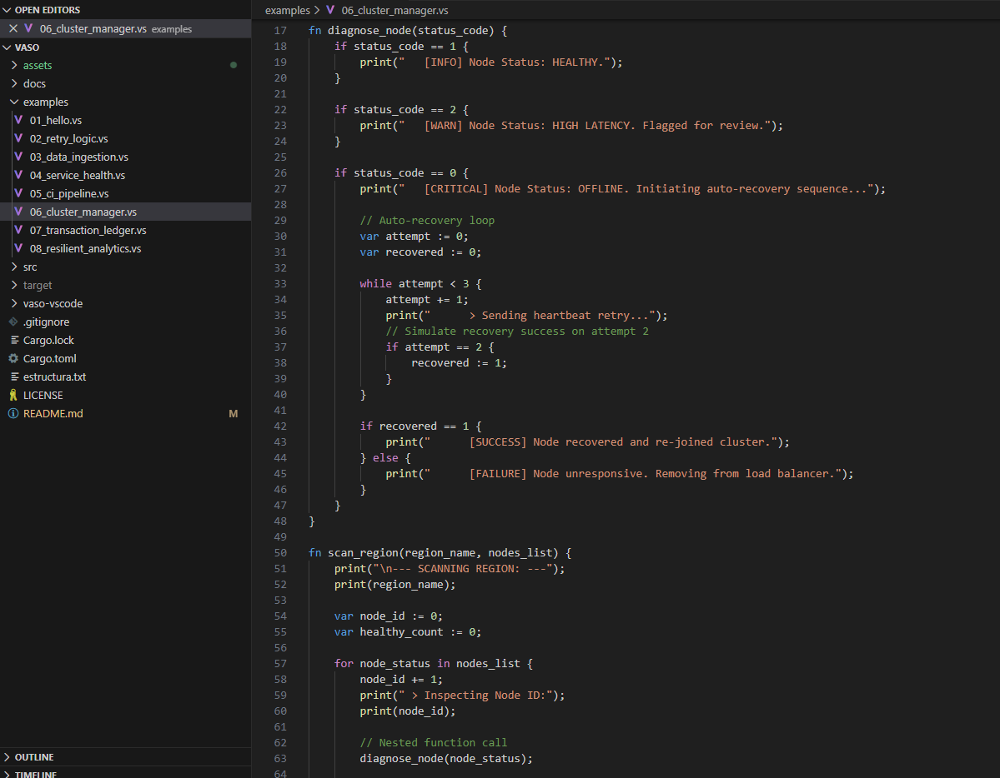
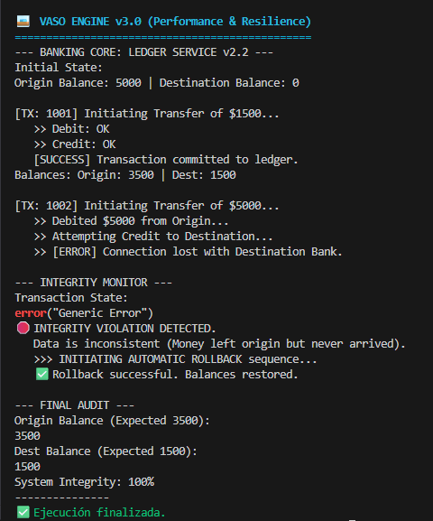
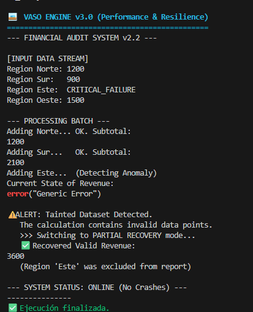

#  Vaso Engine v3.0

> **A Fault-Tolerant Orchestration Language built in Rust.**
> *Status: v3.0 Release (Stable v3.0) - Experimental Engineering Project*

Vaso is a domain-specific language (DSL) designed to solve a specific pain point in DevOps and SRE: **Operational Resilience.**


Unlike general-purpose languages where "errors" often lead to unhandled exceptions and crashes, Vaso treats `Error` as a primitive data type that propagates mathematically. This allows infrastructure scripts to "fail safely," absorb dirty data, and execute recovery logic without stopping the world.


---

##  The Problem vs. The Solution

In traditional scripting (Bash/Python), handling errors in a complex CI/CD pipeline requires verbose "boilerplate hell". If step 3 fails, the entire script might crash unless every single line is wrapped in `try/catch`.

### The Python/Bash Approach (Fragile)
```bash
# If 'build' fails, the script crashes here immediately.
npm run build
if [ $? -ne 0 ]; then
  echo "Build failed"
  exit 1
fi
# Repeat for every single step...

```

### The Vaso Approach (Resilient)

Vaso uses **State Dominance Arithmetic**. You "add" pipeline stages together. If one fails, the `Error` state dominates the result, carries the context, but **the execution flow continues** to the logic block.

```vaso
// Vaso Logic: Simple Math
var build := Sys.exec("npm", "run build");
var test  := Sys.exec("npm", "run test");

// If build fails, 'pipeline' becomes Error state automatically.
// The script DOES NOT CRASH. It propagates the state.
var pipeline := build + test; 

match pipeline {
    on => { 
        print("✅ Pipeline Healthy. Deploying..."); 
        Sys.exec("docker", "push ...");
    }
    error(msg) => { 
        // Logic for recovery happens here
        print("🚨 Pipeline halted safely. Reason: " + msg); 
    }
}

```

---

##  Proof of Concept

### 1. The Ecosystem

*Custom VS Code Extension with syntax highlighting and file icons.*


### 2. ACID Transactions & Auto-Rollback

*Demonstration of Script `07`: The system detects a logic error in a financial ledger and executes an automatic rollback, restoring global variables from a local scope to preserve data integrity.*


### 3. Fault Tolerance vs. Python

*Demonstration of Script `08`: Unlike Python which would crash with a `TypeError` when adding a corrupted datapoint, Vaso absorbs the error, isolates the bad node, and calculates a valid partial report.*



---

## 🚀 Key Technical Features

### 🛡️ V-Bit Logic System

A 5-state logic system that governs all variables in the language.

* **ON (1):** Success / Active.
* **OFF (0):** Inactive / False.
* **LOADING (2):** Processing / Pending.
* **ERROR (3):** Critical Failure / Corruption.
* **UNKNOWN (4):** Indeterminate State.

###  O(1) Jump Map Compiler (v3.0)

To ensure performance in large automation scripts, Vaso v3.0 implements a **Pre-Scan Jump Map**. Before execution, the engine maps all control flow blocks (`if`, `match`, `loops`). This converts flow control complexity from **O(n²)** to **O(1)**, allowing instant jumping between logic blocks regardless of file size.

###  Dynamic Scope Memory

The memory stack allows modifying global variables from deep local scopes. This is critical for implementing **Transaction Rollbacks** and state recovery patterns found in the examples.

---

##  Syntax Overview

Vaso is designed to be familiar to Rust/JS developers but simplified for orchestration.

```vaso
// Variable Declaration (Inferred Types)
var port := 8080;          // Integer
var status := on;          // V-Bit
var config := [1, 2, 3];   // List

// Flow Control (Pattern Matching)
match status {
    on => { print("System Healthy"); }
    error => { print("System Failure"); }
}

// Loops & Iteration
for port in config {
    print("Checking port:");
    print(port);
}

```

---

##  Validated Scenarios (The 8 Examples)

This engine has been validated against 8 production-simulated scenarios found in the `examples/` folder:

| Script | Domain | Concept Demonstrated | Status |
| --- | --- | --- | --- |
| `01_hello.vs` | Basics | System Boot & Memory | ✅ Passing |
| `02_retry_logic.vs` | Database | `while` loops for connection retries | ✅ Passing |
| `03_data_ingestion.vs` | Monitoring | Parsing logs & list processing | ✅ Passing |
| `04_service_health.vs` | Microservices | Aggregating cluster health states | ✅ Passing |
| `05_ci_pipeline.vs` | **DevOps** | **Resilient CI/CD Sequence** | ✅ Passing |
| `06_cluster_manager.vs` | **SRE** | **Auto-Recovery of Dead Nodes** | ✅ Passing |
| `07_transaction_ledger.vs` | **Backend** | **ACID Transactions & Rollback** | ✅ Passing |
| `08_resilient_analytics.vs` | **Data** | **Fault Tolerance & Recovery** | ✅ Passing |

---

##  Installation & Usage

Vaso is built with **Rust**. Ensure you have `cargo` installed.

```bash
# 1. Clone the repo
git clone [https://github.com/ffrayf/Vaso-Lang](https://github.com/ffrayf/Vaso-Lang)

# 2. Run an example (e.g., The Cluster Manager)
cargo run -q examples/06_cluster_manager.vs

```

---

##  Engineering Path

This project was built in a **4-day intensive engineering sprint** to explore compiler theory and system resilience.

* **v1.0:** Lexer/Parser implementation using `Logos`.
* **v2.0:** Memory Stack & Scope Management.
* **v2.2:** Implementation of ACID Transactions & Fault Tolerance logic.
* **v3.0 (Current):** Performance Refactor (Jump Maps for O(1) parsing) & Strict Lexing.

---

*Created by **Fabian Fray** - 2025*
