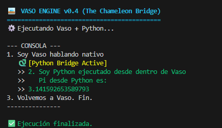
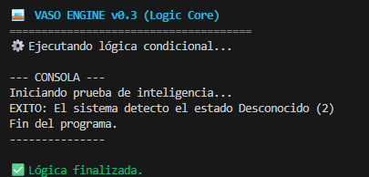
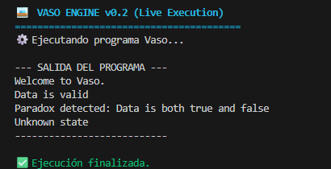
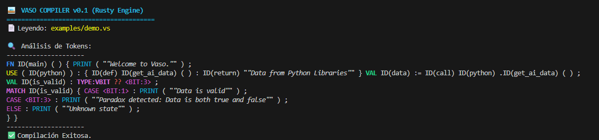

# Vaso Programming Language 🥃

> **"Simple as a spoon, Fast as a rocket."**

Vaso is an **experimental programming language concept** designed to explore a new paradigm: unifying high-level simplicity with low-level hardware control, without the boilerplate.

This project is a **proof of concept (Prototype)**. It proposes a novel **5-state logic system (Quantum-Ready)** and seamless multi-language interoperability, aiming to strip away unnecessary abstractions to get closer to the metal, while keeping the syntax human-friendly.

## 💡 The Philosophy

We believe modern computing has become unnecessarily complex. Vaso aims to return to the roots:

* **Socratic Simplicity:** If a spoon doesn't need a manual, neither should a variable declaration. "Keep it simple" is our core dogma.
* **Hardware Agnosticism:** The language design intends to be smart enough to utilize the GPU (like an RTX series) or CPU automatically, blurring the line between host and device code.
* **Legacy-Free Logic:** Reimagining binary logic by introducing "V-Bits" to handle uncertainty natively, preparing for a future of AI and probabilistic computing.

## 🚀 Key Features (Proposed)

### 1. Hybrid Syntax
Write code as simple as Python or as controlled as C++. Vaso adapts to the complexity of the task, not the other way around.

### 2. The "Chameleon" Bridge
Native support to embed other languages directly to leverage existing ecosystems instantly.

```vaso
use(python): {
    import numpy as np
    # Seamless execution of external libraries
}
```

### 3. V-Bit Logic (Quantum-Ready)
Native support for a 5-state logic system, moving beyond traditional boolean (`true/false`) constraints:
* `0` = **No**
* `1` = **Yes**
* `2` = **Unknown** (Probabilistic)
* `3` = **Paradox** (Yes and No / Superposition)
* `4` = **Null** (Void)

### 4. Hardware Aware
Automatic optimization for heterogeneous computing. The goal is to allow the compiler to decide the best execution path (CPU vs GPU) based on workload density.

## ⚠️ Project Status: Pre-Alpha / Prototype

**Current version: v0.1.0 (Concept / Prototype)**

The current implementation acts as a **prototype interpreter** to demonstrate the syntax, the logical flow, and the philosophy of the language. The core compiler (targeted to be built with Rust & LLVM for maximum performance) is currently in the architectural design phase.

**This is an experimental proposal, not yet a production-ready tool.**

## 🛠️ Example Code

```vaso
// file: demo.vs
use std.io;

fn main() {
    // 1. Simplicity in action
    val message := "Hello World from Vaso";
    print(message);

    // 2. The Power of V-Bit (5-state logic)
    // We use 'vbit' type instead of bool to handle uncertainty
    val status : vbit = 2; // State: Unknown/Probable
    
    if status == 2 {
        print("Status is uncertain. Initiating deep check...");
    }
}
```


## 📸 System Architecture & Demos

### Phase 4: The Chameleon Bridge (v0.4) - Interoperability 🐍
**Breaking Barriers.** Vaso now acts as a multi-language orchestrator. The `use(python)` block allows seamless embedding and execution of external Python scripts directly within Vaso code. This proves the "Glue Language" concept, leveraging the entire Python ecosystem (Math, AI, Data Science) from a high-performance Rust core without syntax friction.



### Phase 3: Logic Core (v0.3) - Intelligent Branching 🧠
The engine has evolved into a decision-making machine. Vaso now supports **Memory Management** (`HashMap`) and **Control Flow** (`if/else`). It correctly interprets the custom 5-state variables (`vbit`) and executes specific code blocks based on logic, skipping false conditions.



### Phase 2: The Engine (v0.2) - Live Execution
The first implementation of the linear interpreter. Capable of allocating memory variables and executing standard output instructions. This proved the language could "act" and not just "read".



### Phase 1: The Lexer (v0.1) - Tokenization
The foundation. Under the hood, Vaso uses a custom Lexer built with `Logos` in Rust to break down source code into atomic tokens, optimizing for Windows/Linux environments and recognizing the custom syntax.


## 🤝 Contribution & Acknowledgments

**Created by Fabian Fray.**

*This project is being developed with the assistance of advanced AI models for architectural brainstorming, rapid prototyping, and code optimization.*

We are looking for contributors who share the vision of simplifying the future of coding. If you are an engineer, a philosopher, or just curious, feel free to open a discussion.

---
*© 2025 The Vaso Project. Licensed under MIT.*